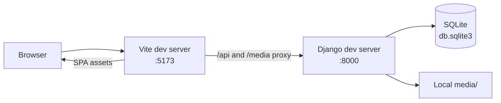
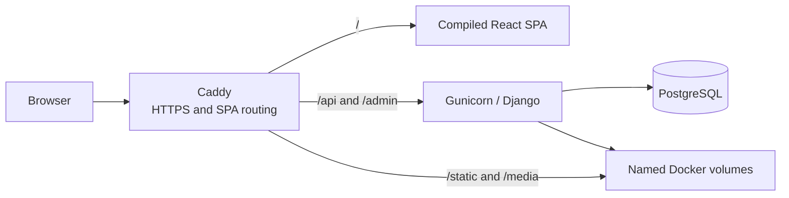

# LUA

LUA is the public website and content platform for the Latvian Fire Safety Association. It pairs a React single-page application with a Django REST API and administration interface for news, member data, protected public forms, and uploaded media.

## Contents

- [Architecture](#architecture)
- [Quick start](#quick-start)
- [Development](#development)
- [Content and localization](#content-and-localization)
- [API reference](#api-reference)
- [Configuration](#configuration)
- [Production deployment](#production-deployment)
- [Operations and backups](#operations-and-backups)
- [Security and abuse prevention](#security-and-abuse-prevention)
- [Troubleshooting](#troubleshooting)
- [Quality checks](#quality-checks)

## Architecture

The browser application is a React 17 single-page application (SPA). Django provides editorial administration, public JSON endpoints, form processing, email delivery, and media storage. PostgreSQL is used in the Docker deployment; local development uses SQLite unless PostgreSQL environment variables are supplied.





| Area | Responsibility |
| --- | --- |
| `src/` | React views, shared UI, language selection, and API client |
| `blogs/` | Django models, admin, REST endpoints, form validation, email, Turnstile, and rate limiting |
| `lua/` | Django project settings and root URL configuration |
| `docker-compose.yml` | Caddy, Django/Gunicorn, PostgreSQL, and persistent volumes |
| `Caddyfile` | HTTPS, reverse proxying, static/media serving, and SPA fallback routing |

## Quick start

### Windows

Install Python 3.12 or later and Node.js 18 or later, then run:

```powershell
.\run.bat
```

The script creates `venv/` when needed, installs Python and Node dependencies, creates a development `.env` with a random `SECRET_KEY` and console email backend when one does not exist, applies migrations, and opens Django and Vite in separate terminals.

### macOS and Linux

Use two terminals after installing Python 3.12 or later, Node.js 18 or later, and npm:

```bash
python3 -m venv venv
. venv/bin/activate
python -m pip install -r requirements.txt
printf 'SECRET_KEY=replace-this-with-a-development-secret\nEMAIL_BACKEND=django.core.mail.backends.console.EmailBackend\n' > .env
python manage.py migrate
python manage.py runserver
```

In a second terminal:

```bash
npm install
npm run dev
```

## Development

Use the Vite URL for normal browser testing. Its development proxy forwards `/api` and `/media` to Django, so client-side requests behave like same-origin requests.

| Service | Local URL | Purpose |
| --- | --- | --- |
| React SPA | `http://localhost:5173` | Normal development entry point |
| Django API | `http://127.0.0.1:8000/api/` | Direct REST endpoint inspection |
| Django admin | `http://127.0.0.1:8000/admin/` | Editorial content and member management |

Create an editorial account before using the Django admin:

```powershell
.\venv\Scripts\python.exe manage.py createsuperuser
```

```bash
python manage.py createsuperuser
```

The backend stores local development data in `db.sqlite3`. Uploaded files are written to `media/`, served by Django only while `DEBUG=True`, and intentionally excluded from version control.

Build and locally preview the production frontend with:

```bash
npm run build
npm run preview
```

## Production deployment

The supported production topology runs the compiled Vite frontend, Django API/admin, PostgreSQL, and Caddy on one Linux VPS. Docker Compose builds the frontend once and Caddy serves the resulting static files; Vite does not run in production.

```text
Browser -> Caddy -> React frontend / Django Gunicorn -> PostgreSQL
```

Caddy is the only public container. It manages HTTPS certificates, serves the compiled React application, `/static/`, and `/media/`, and proxies `/api/` and `/admin/` to Gunicorn. PostgreSQL and Gunicorn stay on Docker's internal network.

### First deployment

Install Docker Engine with the Compose plugin on the VPS, clone the repository, and create the deployment environment file:

```bash
cp .env.example .env
chmod 600 .env
```

Set the required values in `.env` before starting the stack. At minimum configure `DOMAIN`, `SECRET_KEY`, `ALLOWED_HOSTS`, `CSRF_TRUSTED_ORIGINS`, the three `POSTGRES_*` credentials, and the email settings. `VITE_TURNSTILE_SITE_KEY` is a frontend build-time value; `TURNSTILE_SECRET_KEY` is server-only.

Point the domain's DNS records to the VPS. When using Cloudflare, enable the proxy and set **SSL/TLS encryption mode** to **Full (strict)**. Do not use Flexible mode.

The default HSTS lifetime is 30 days. Leave `SECURE_HSTS_INCLUDE_SUBDOMAINS` and `SECURE_HSTS_PRELOAD` disabled until every current and future subdomain is guaranteed to serve HTTPS.

Build and start the services:

```bash
docker compose up --build -d
docker compose ps
docker compose logs -f web
```

Create the first editorial user after the stack is healthy:

```bash
docker compose exec web python manage.py createsuperuser
```

### Updating

Pull the changed code and rebuild the stack:

```bash
git pull
docker compose up --build -d
```

The backend entrypoint applies migrations and runs `collectstatic` before Gunicorn starts. This is appropriate for the initial single `web` service. Move migrations to a dedicated deployment job before running multiple backend replicas.

## Operations and backups

### Persistent data

Compose keeps PostgreSQL, uploaded files, Django static files, and Caddy certificate state in named volumes. Rebuilding or restarting containers does not remove these volumes.

Do not run the following command in production unless intentionally destroying all persistent database and upload data:

```bash
docker compose down -v
```

### Backup and restore

Take off-VPS backups of both PostgreSQL and media files. A database dump can be created with:

```bash
docker compose exec -T db pg_dump -U "$POSTGRES_USER" "$POSTGRES_DB" > lua-db-backup.sql
```

Use `docker volume ls` to find the Compose media volume, archive it regularly, and copy both backup artifacts to storage outside the VPS. Test restoring a database dump and media archive before launch.

To restore a database dump into the running deployment, copy the backup to the VPS and run:

```bash
cat lua-db-backup.sql | docker compose exec -T db sh -c 'psql -U "$POSTGRES_USER" -d "$POSTGRES_DB"'
```

From PowerShell, use:

```powershell
Get-Content lua-db-backup.sql | docker compose exec -T db sh -c 'psql -U "$POSTGRES_USER" -d "$POSTGRES_DB"'
```

Restore the media archive into the named media volume before exposing the site. Database and media backups are a pair: restoring only the database can leave published image URLs broken.

### Operations checks

```bash
docker compose ps
docker compose logs --tail=100 web
docker compose logs --tail=100 caddy
docker compose exec web python manage.py check --deploy
```

Verify the deployed domain, a direct client-side route such as `/kontakti`, `/api/posts/`, `/admin/`, an uploaded image under `/media/`, and the public form submissions after each initial deployment.

## Configuration

Copy `.env.example` to `.env` for production. Keep `.env` out of version control and restart affected services after changes. The Windows setup script creates a minimal development `.env`; it is not suitable for production.

| Variable or group | Scope | Required | Purpose |
| --- | --- | --- | --- |
| `SECRET_KEY` | Django server | Yes | Cryptographic signing key. Use a long, unique secret in production. |
| `DEBUG`, `ALLOWED_HOSTS`, `CSRF_TRUSTED_ORIGINS` | Django server | Yes in production | Controls production-safe Django behavior and accepted hosts/origins. |
| `CORS_ALLOWED_ORIGINS` | Django server | When frontend and API use different origins | Permits a separately hosted frontend to call the API. |
| `POSTGRES_DB`, `POSTGRES_USER`, `POSTGRES_PASSWORD` | Docker database and Django server | Yes in Docker | PostgreSQL credentials. `POSTGRES_HOST=db` is set by Compose. |
| `EMAIL_*`, `DEFAULT_FROM_EMAIL`, form recipients | Django server | Yes for real form delivery | SMTP transport and destinations for public form submissions. |
| `VITE_API_BASE_URL` | Frontend build-time | Required for a separately hosted API | API origin without a trailing slash. It defaults to `/api` for the Vite proxy and same-origin Docker deployment. |
| `VITE_TURNSTILE_SITE_KEY` | Frontend build-time | Yes for public forms | Cloudflare Turnstile site key embedded in the built frontend. |
| `TURNSTILE_SECRET_KEY` | Django server | Yes for public forms | Server-only key used to validate Turnstile tokens. |
| `FORM_RATE_LIMIT_*` | Django server | Optional | Submission quotas and time windows. |

The provided [vercel.json](vercel.json) only rewrites requests to the SPA. A Vercel-hosted frontend therefore needs `VITE_API_BASE_URL` set at build time to a separately deployed Django API; it cannot serve the Django `/api/` or `/admin/` routes itself.

### Turnstile

Protecting the contact, membership, and registry forms requires these variables in `.env` and in the deployed frontend/backend environments:

```dotenv
VITE_TURNSTILE_SITE_KEY=your-turnstile-site-key
TURNSTILE_SECRET_KEY=your-turnstile-secret-key
```

`VITE_TURNSTILE_SITE_KEY` is intentionally exposed to the browser so the widget can render. Keep `TURNSTILE_SECRET_KEY` on the Django server only; it is used to validate each `cf-turnstile-response` with Cloudflare before a form is processed. Vite-prefixed variables are embedded during `npm run build`; rebuild the frontend or Caddy image after changing the site key, and restart Django after changing the secret key.

For compatibility, the existing `VITE_TURNSTILE_API_KEY` and `TURNSTILE_SITE_KEY` variable names are also accepted. Prefer the names above for new deployments.

### Form rate limits

After Turnstile succeeds, Django rate-limits email-sending form submissions by client IP to limit spam and email abuse. The defaults are five total form submissions per hour, with additional per-form limits of three contact submissions per hour, two membership submissions per day, and three registry submissions per day. Exceeding a limit returns JSON `429 Too Many Requests` with a `Retry-After` header; no email is sent.

The limits can be adjusted with these server-only environment variables:

```dotenv
FORM_RATE_LIMIT_SHARED_LIMIT=5
FORM_RATE_LIMIT_SHARED_WINDOW_SECONDS=3600
FORM_RATE_LIMIT_CONTACT_LIMIT=3
FORM_RATE_LIMIT_CONTACT_WINDOW_SECONDS=3600
FORM_RATE_LIMIT_MEMBERSHIP_LIMIT=2
FORM_RATE_LIMIT_MEMBERSHIP_WINDOW_SECONDS=86400
FORM_RATE_LIMIT_REGISTRY_LIMIT=3
FORM_RATE_LIMIT_REGISTRY_WINDOW_SECONDS=86400
```

The default Django local-memory cache makes these limits effective for one Django process. Configure `FORM_RATE_LIMIT_CACHE_ALIAS` to use a shared Django cache alias before running multiple backend workers or replicas. Keep `FORM_RATE_LIMIT_TRUST_X_FORWARDED_FOR=False` unless a trusted reverse proxy removes client-supplied forwarding headers and sets its own. Enabling it behind an untrusted proxy lets clients choose the IP address used for rate limiting.

## Content and localization

### Publishing content

Create the first editorial account with:

```powershell (Windows)
python manage.py createsuperuser
```
```Bash (Linux/MacOS)
python3 manage.py createsuperuser
```

Open `http://127.0.0.1:8000/admin/` to manage reusable tags and publish posts. Each post can have any number of tags and an ordered set of images. The image with the lowest position becomes the cover shown on the news list; all post images appear in the article gallery. Add useful alt text for every image.

The Django admin also manages members, member tags, and honorary members. The main data relationships are:

| Model | Relationships and behavior |
| --- | --- |
| `Post` | Has many reusable `Tag` records and ordered `PostImage` records. Posts are returned newest first. |
| `PostImage` | Belongs to one post; stored under `media/posts/`; ordered by `position`, then ID. |
| `Member` | Has many `MemberTag` records and an optional public website/logo. Logos are stored under `media/members/logos/`. |
| `HonorableMember` | An independently managed, alphabetically ordered name. |

### Localization

[src/i18n/LanguageContext.jsx](src/i18n/LanguageContext.jsx) owns the in-browser Latvian (`lv`) and English (`en`) interface translations. It stores the active language in `localStorage` under `lua-language` and updates the document language attribute. Add UI copy to both translation objects, then retrieve it through `useLanguage()`; content published in Django remains editorial data and is not automatically translated.

## API reference

The frontend sends requests to `${VITE_API_BASE_URL || '/api'}`. Development defaults to `/api` because Vite proxies it to Django. All read endpoints return JSON and use trailing slashes.

### Content endpoints

| Method | Path | Access | Description |
| --- | --- | --- | --- |
| `GET` | `/api/posts/` | Public | Posts, newest first, with nested tags and ordered images. |
| `GET` | `/api/posts/<id>/` | Public | A single post. |
| `POST`, `PUT`, `PATCH`, `DELETE` | `/api/posts/` and `/api/posts/<id>/` | Authenticated Django user | DRF writes for posts. Use Django admin for the supported editorial workflow. |
| `GET` | `/api/tags/` | Public | Reusable post tags. |
| `GET` | `/api/members/` and `/api/members/<id>/` | Public | Members, including member tags and optional logo URL. |
| `GET` | `/api/honorable-members/` and `/api/honorable-members/<id>/` | Public | Honorable members. |
| `GET` | `/api/member-tags/` and `/api/member-tags/<id>/` | Public | Reusable member tags. |

Example `GET /api/posts/` response:

```json
[
	{
		"id": 42,
		"title": "Fire safety update",
		"content": "Article body",
		"tags": [{ "id": 3, "name": "News" }],
		"images": [
			{
				"id": 12,
				"image": "/media/posts/cover.jpg",
				"alt_text": "Fire extinguisher inspection",
				"position": 1
			}
		],
		"created_at": "2026-07-24T10:30:00Z"
	}
]
```

### Public form endpoints

Form endpoints accept `multipart/form-data` or URL-encoded fields, not JSON. They are CSRF-exempt for this public workflow, but every submission must include a current Cloudflare Turnstile token in `cf-turnstile-response`. Configure CORS before calling these endpoints from a different browser origin.

| Method | Path | Required application fields |
| --- | --- | --- |
| `POST` | `/api/kontakti/` | `name`, `email`, `message` |
| `POST` | `/api/ktparbiedru/` | `companyName`, `position`, `fullName`, `email`, `phone`, `companyDescription` |
| `POST` | `/api/registrs/` | `fullName`, `email`, `companyName` |

Example contact submission:

```bash
curl --request POST http://127.0.0.1:8000/api/kontakti/ \
	--form "name=Jane Doe" \
	--form "email=jane@example.com" \
	--form "message=Please contact me." \
	--form "cf-turnstile-response=<valid-token>"
```

Successful submissions return `200 OK`:

```json
{
	"success": true,
	"message": "Ziņa saņemta",
	"correlationId": "1c8f0a34-9c40-4aee-8b9f-12a43ea07aac"
}
```

| Status | Meaning | Response details |
| --- | --- | --- |
| `400` | Turnstile failure or invalid fields | `success: false`, an `errors` object, and `correlationId`. |
| `429` | Shared or endpoint-specific quota exceeded | `errors.rateLimit`, `correlationId`, and a `Retry-After` response header in seconds. |
| `500` | Email delivery failed | `success: false`, a user-facing message, and `correlationId`. |

The registry handler currently sends to `MEMBERSHIP_FORM_RECIPIENT`. `REGISTRATION_FORM_RECIPIENT` is read from the environment but is not consumed by the current view implementation.

- `GET /api/posts/`
- `GET /api/posts/<id>/`
- `GET /api/tags/`
- `GET /api/members/`
- `GET /api/members/<id>/`
- `GET /api/honorable-members/`
- `GET /api/honorable-members/<id>/`
- `GET /api/member-tags/`

The Vite development server proxies `/api` and `/media` to Django. Uploaded files are stored locally in `media/` and served by Django only while `DEBUG=True`; this directory is intentionally not committed. Production deployment needs persistent media storage and web-server or object-storage configuration.

## Email diagnostics

Restart Django after changing any `.env` mail setting. The development autoreloader can inherit values that `python-dotenv` loaded when the parent process first started, so editing `.env` alone may leave the running server on an older backend or recipient configuration.

Print the effective Django email configuration without exposing the SMTP password or sending mail:

```powershell
.\venv\Scripts\python.exe manage.py diagnose_email
```

The command masks addresses and includes short fingerprints so values can be compared between local and deployed runtimes. To explicitly send uniquely traceable probes to the configured association recipients:

```powershell
.\venv\Scripts\python.exe manage.py diagnose_email --send --form-recipients
```

Use a separate Gmail or control mailbox for comparison by repeating `--recipient` as needed:

```powershell
.\venv\Scripts\python.exe manage.py diagnose_email --send --recipient test@example.com --recipient control@example.net
```

Diagnostic probes and the contact/membership forms log correlation IDs, Message-IDs, masked recipients, backend send counts, and duration. The frontend also exposes the response correlation ID in browser errors. A send count of `1` confirms that the configured backend accepted the handoff; use the Message-ID to search Gmail with `rfc822msgid:<Message-ID>` when checking downstream delivery. The registry form returns a correlation ID but currently uses Django's direct `send_mail` call rather than the traced email helper.

## Security and abuse prevention

- **Secrets:** Keep `.env`, SMTP credentials, `SECRET_KEY`, and `TURNSTILE_SECRET_KEY` out of source control. Rotate a credential immediately if it is exposed.
- **HTTPS:** Caddy obtains and serves HTTPS certificates for the configured domain. When Cloudflare is used, select **Full (strict)** TLS; Flexible mode leaves the Cloudflare-to-origin hop unencrypted.
- **HSTS:** The default HSTS duration is 30 days. Leave `SECURE_HSTS_INCLUDE_SUBDOMAINS` and `SECURE_HSTS_PRELOAD` disabled until every current and future subdomain serves HTTPS.
- **Browser origins:** Set `ALLOWED_HOSTS`, `CSRF_TRUSTED_ORIGINS`, and, for a split frontend/API deployment, `CORS_ALLOWED_ORIGINS` to the exact public origins. Do not use wildcards for authenticated production traffic.
- **Public forms:** Turnstile runs before validation and rate limiting. The default in-memory rate-limit cache is appropriate only for the single Gunicorn worker configured by the Docker image; use a shared cache before scaling.
- **Client IPs:** Only enable `FORM_RATE_LIMIT_TRUST_X_FORWARDED_FOR` when every upstream proxy removes incoming forwarding headers and supplies a trusted one.
- **Admin:** Create individual editorial accounts, use strong unique passwords, and remove access promptly when responsibilities change.

## Troubleshooting

| Symptom | Likely cause | Verify | Resolution |
| --- | --- | --- | --- |
| Django will not start with `KeyError: SECRET_KEY` | `.env` is missing or incomplete | Check that `.env` contains `SECRET_KEY` | Run `run.bat` on Windows or create a development `.env` as shown in Quick start. |
| Browser calls to `/api/` return `404` locally | The browser is using Django directly or Vite is not running | Open `http://localhost:5173` and inspect the Vite terminal | Start `npm run dev` and use the Vite URL. |
| A separately hosted frontend cannot call the API | `VITE_API_BASE_URL` or `CORS_ALLOWED_ORIGINS` is incorrect | Inspect the built frontend environment and browser network/CORS error | Rebuild with the API origin and add the exact frontend origin to `CORS_ALLOWED_ORIGINS`. |
| A form returns `400` with `errors.turnstile` | Missing, expired, invalid, or unconfigured Turnstile token | Check browser console and Django logs | Set both Turnstile keys, rebuild after site-key changes, and submit a new token. |
| A form returns `429` | Shared or endpoint-specific quota was reached | Inspect the `Retry-After` response header | Wait for that duration or adjust the relevant `FORM_RATE_LIMIT_*` values. |
| A form returns `500` after validation | SMTP configuration or remote delivery handoff failed | Run `python manage.py diagnose_email` | Correct SMTP settings, restart Django, then retry `diagnose_email --send` using a controlled recipient. |
| Emails appear in the Django console | Development uses the console mail backend | Run `python manage.py diagnose_email` | Set `EMAIL_BACKEND` to the SMTP backend and configure SMTP credentials when testing real delivery. |
| `/media/` URLs are `404` in production | The media volume is empty, not mounted, or was not restored | Run `docker compose ps` and inspect the media volume | Restore the media archive and confirm the Caddy `media_data` mount remains read-only. |
| Direct navigation to `/kontakti` gives `404` in production | The front proxy is not applying SPA fallback routing | Inspect the active Caddy configuration | Serve the compiled frontend through the supplied Caddy configuration, which falls back to `index.html`. |
| PostgreSQL cannot connect in Docker | Database credentials or health check are not ready | Run `docker compose ps` and `docker compose logs --tail=100 db` | Correct `POSTGRES_*` values, then restart the stack; the web service waits for database health. |
| Migrations fail during deployment | An incompatible schema or interrupted previous deployment exists | Run `docker compose logs --tail=100 web` | Back up first, resolve the migration error locally, then redeploy. Do not delete production volumes to bypass a migration failure. |

## Quality checks

Run the backend tests and frontend production build before merging or deploying:

```powershell
.\venv\Scripts\python.exe manage.py test blogs
npm.cmd run build
```

```bash
python manage.py test blogs
npm run build
```

The Django test suite covers the public content API, form validation, Turnstile rejection, email handoff behavior, and rate-limit responses. The frontend currently has no dedicated test script; `npm run build` is the available integration check for the React bundle.

For production configuration changes, run Django's deployment checklist from an environment with production-style values:

```bash
python manage.py check --deploy
```

Before opening a change for review, keep documentation and code changes focused, run the checks relevant to the touched behavior, and verify any changed public form in a browser with a valid Turnstile configuration.
